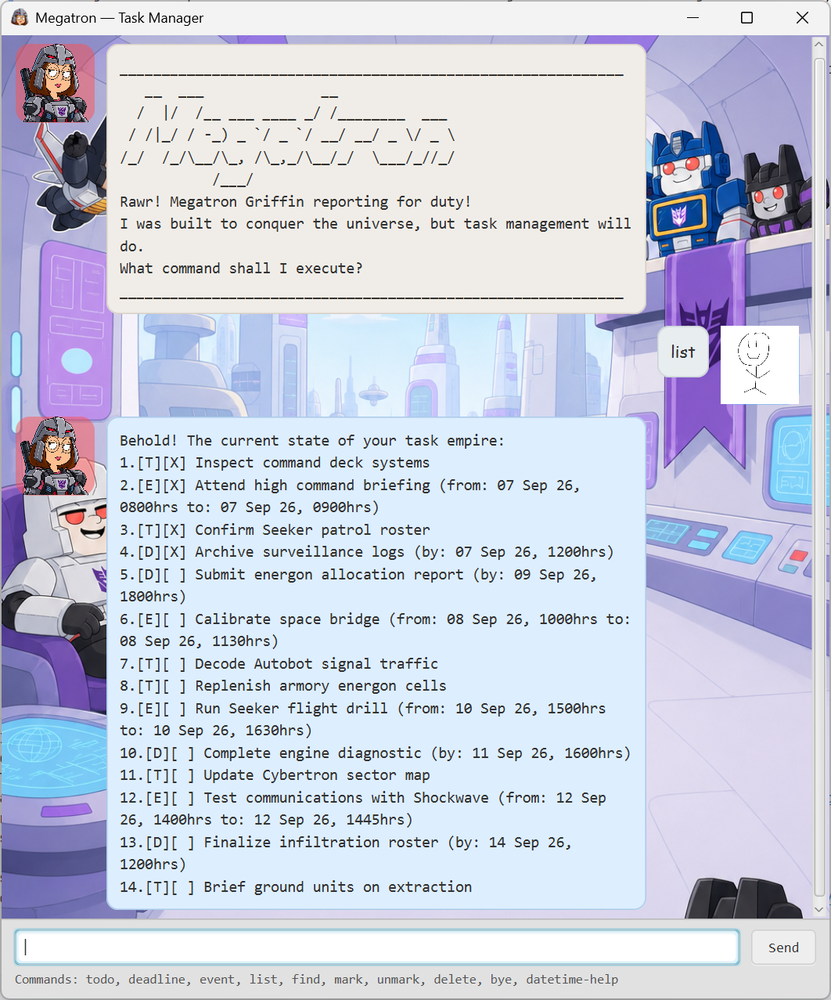
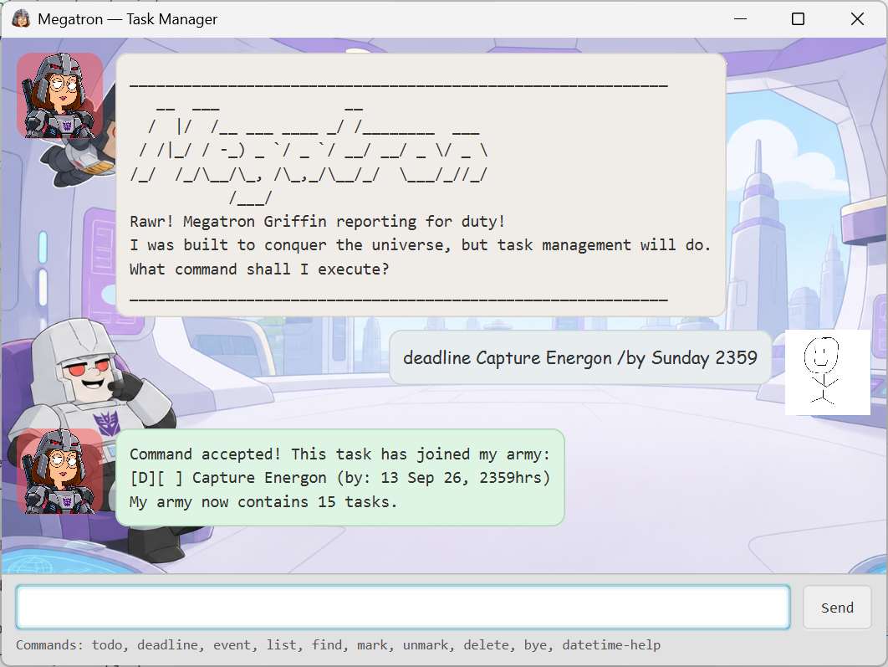
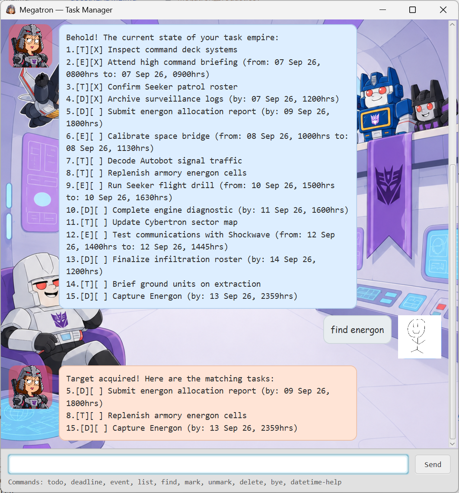

# Megatron User Guide

Megatron is a desktop chatbot that helps you manage todos, deadlines, and events. Type a command in
the message box and press **Enter** or click **Send**. Megatron saves each change automatically, so
your tasks are available the next time that you start the app.



## Quick start

Megatron requires Java 25.

1. Open a terminal in the project folder.
2. Build the app:

   ```powershell
   .\gradlew.bat shadowJar
   ```

   On macOS or Linux, use `./gradlew shadowJar`.

3. Start the app:

   ```powershell
   java -jar build/libs/megatron.jar
   ```

   To use a different data file, give its path as the first argument:

   ```powershell
   java -jar build/libs/megatron.jar data/another-file.csv
   ```

4. Enter `todo read user guide` to add your first task.

> **Note:** Commands are case-sensitive. Enter command words such as `todo` and `list` in
> lowercase.

## Command summary

| Action | Command format | Example |
| --- | --- | --- |
| Add a todo | `todo DESCRIPTION` | `todo buy groceries` |
| Add a deadline | `deadline DESCRIPTION /by DATE_TIME` | `deadline submit report /by 20 Sep 2026 6pm` |
| Add an event | `event DESCRIPTION /from START /to END` | `event project meeting /from monday 2pm /to 3pm` |
| Show all tasks | `list` | `list` |
| Find tasks | `find QUERY` | `find report` |
| Mark a task as done | `mark TASK_NUMBER` | `mark 2` |
| Mark a task as not done | `unmark TASK_NUMBER` | `unmark 2` |
| Delete a task | `delete TASK_NUMBER` | `delete 2` |
| Show date and time help | `datetime-help` | `datetime-help` |
| Exit Megatron | `bye` | `bye` |

`DESCRIPTION`, `DATE_TIME`, `START`, `END`, `QUERY`, and `TASK_NUMBER` are values that you must
provide. Do not type the uppercase placeholder words.

## Features

### Adding a todo

To add a task that does not have a date or time:

1. Enter `todo DESCRIPTION`, for example, `todo buy groceries`.
2. Press **Enter** or click **Send**.

Outcome: Megatron adds the todo and displays it as not done:

```text
[T][ ] buy groceries
```

### Adding a deadline

To add a task that you must finish by a specified date or time:

1. Enter `deadline DESCRIPTION /by DATE_TIME`, for example,
   `deadline submit report /by 20 Sep 2026 6pm`.
2. Press **Enter** or click **Send**.

Outcome: Megatron adds the deadline and displays its date and time in a standard format:

```text
[D][ ] submit report (by: 20 Sep 26, 1800hrs)
```



### Adding an event

To add an activity that has a start and an end:

1. Enter `event DESCRIPTION /from START /to END`, for example,
   `event project meeting /from 20 Sep 2026 2pm /to 3:30pm`.
2. Press **Enter** or click **Send**.

Outcome: Megatron adds the event and displays its start and end. The end must be after the start.
If you give only a time for `END`, Megatron uses the start date:

```text
[E][ ] project meeting (from: 20 Sep 26, 1400hrs to: 20 Sep 26, 1530hrs)
```

### Using dates and times

To see the supported date and time formats:

1. Enter `datetime-help`.
2. Press **Enter** or click **Send**.

Outcome: Megatron displays the supported formats and interpretation rules. Common formats include:

| Input type | Supported examples |
| --- | --- |
| ISO date | `2026-09-20` |
| Numeric date | `20/9/2026` |
| Text date | `Sep 20 2026`, `20 September 2026` |
| Date and time | `20 Sep 2026 1800`, `20 Sep 2026 6pm` |
| Weekday | `mon`, `monday 6pm` |
| Time | `1800`, `18:00`, `6pm`, `6:30pm` |

Megatron applies these rules:

- A date without a time uses midnight (`0000hrs`).
- A text date without a year uses the current year. For example, `Sep 20` uses September 20 of the
  current year.
- A weekday uses its next available occurrence. If today's specified time has passed, Megatron uses
  the same weekday in the next week.
- A time-only event end uses the event start date.

### Listing tasks

To see all tasks and their task numbers:

1. Enter `list`.
2. Press **Enter** or click **Send**.

Outcome: Megatron displays all tasks in the order that you added them:

```text
1.[T][ ] buy groceries
2.[D][X] submit report (by: 20 Sep 26, 1800hrs)
```

The task markers have these meanings:

- `[T]`: todo
- `[D]`: deadline
- `[E]`: event
- `[ ]`: not done
- `[X]`: done

### Finding tasks

To find tasks by their descriptions:

1. Enter `find QUERY`, for example, `find report`.
2. Press **Enter** or click **Send**.

Outcome: Megatron displays the matching tasks with their original task numbers. Finding tasks does
not change your stored list.

The search ignores letter case and accepts parts of words. For search terms with at least three
characters, it also accepts one inserted, deleted, or changed character. If you give multiple terms,
all terms must match, but their order does not matter.

Examples:

- `find BOO` matches `read book`.
- `find bok` matches `read book` because `bok` is one edit away from `book`.
- `find book read` matches `read book` because both terms occur in the description.
- `find bk` does not match `book` because short terms do not use fuzzy matching.

Use the original task numbers with `mark`, `unmark`, and `delete`.



### Marking a task as done

To mark a task as done:

1. Find the task number with `list` or `find`.
2. Enter `mark TASK_NUMBER`, for example, `mark 2`.
3. Press **Enter** or click **Send**.

Outcome: Megatron changes the task's status marker from `[ ]` to `[X]`.

### Marking a task as not done

To restore a task that you marked as done:

1. Find the task number with `list` or `find`.
2. Enter `unmark TASK_NUMBER`, for example, `unmark 2`.
3. Press **Enter** or click **Send**.

Outcome: Megatron changes the task's status marker from `[X]` to `[ ]`.

### Deleting a task

To delete a task:

1. Find the task number with `list` or `find`.
2. Enter `delete TASK_NUMBER`, for example, `delete 2`.
3. Press **Enter** or click **Send**.

Outcome: Megatron removes the task. The numbers of later tasks change, so use `list` again before
another task-number command.

### Exiting Megatron

To end the current session:

1. Enter `bye`.
2. Press **Enter** or click **Send**.

Outcome: Megatron disables the message box and the **Send** button. Close the window when you are
ready.

## Data and limits

Megatron stores tasks in `data/megatron.csv` by default and loads them when the app starts. To use a
different data file, give its path as the first argument when you start Megatron. Do not edit the
selected file while Megatron is open. The task list can contain at most 100 tasks. Delete a task
before you add a new task to a full list.

## Command problems

If Megatron rejects a command, check these points:

- Use lowercase command words.
- Include a description after `todo`, `deadline`, or `event`.
- Include `/by` in a deadline and `/from` plus `/to` in an event.
- Use `datetime-help` to check the date and time format.
- Use `list` to check that a task number exists.
